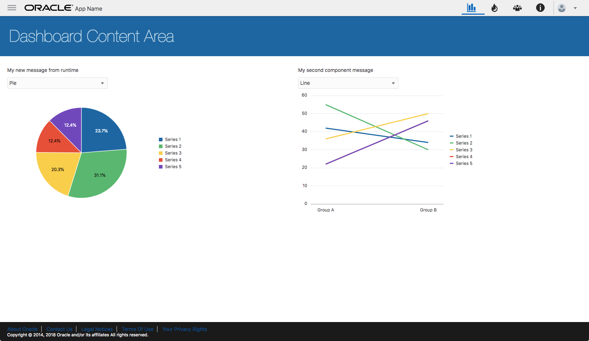

# Run

package.json

```bash
# use npm script to run
"scripts": {
    "serve": "ojet serve --themes=demo",
    "build": "ojet build --themes=demo --release"
}
npm install
npm run serve
npm run build
```

# Learn JET

* [Oracle JET trunk (Internal) ](http://jet.us.oracle.com/trunk/)
* [Developer's Guide](http://www.oracle.com/pls/topic/lookup?ctx=jet500&id=JETDG)
* [Cookbook](http://www.oracle.com/webfolder/technetwork/jet/jetCookbook.html)
* [API Documentation](http://www.oracle.com/webfolder/technetwork/jet/globalSupport-API.html)
* [Oracle JET 4.x MOOC (Video)](https://www.youtube.com/watch?v=CdJ23oroPcw&list=PLKCk3OyNwIztCYiFvqx2UU8Sg8YfK3Om4)
* [Composite Component Chart Demo](https://github.com/peppertech/HOL2017/tree/master/beginners-start)

# TODO list
- [x] basic framework 
- [x] add fixed header
- [x] add custom composite
- [x] udpate footer
- [x] update top-header
- [x] add banner panel
- [x] 3rd Party integration
- [x] CKeditor Integration
- [x] !!!! bug Refresh Window the router module can't reset
- [ ] Restful API
- [ ] Canvas
- [ ] Drag-Droll
- [ ] Add Tour